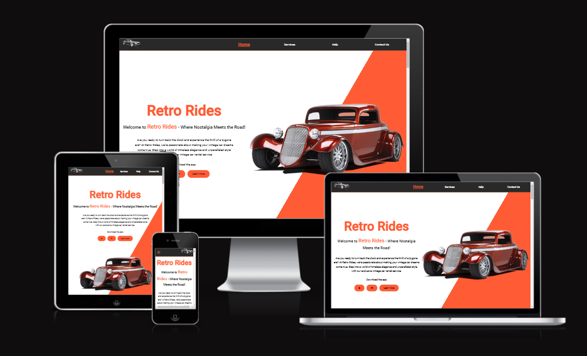
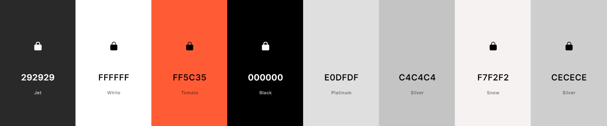
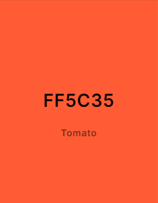
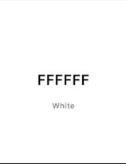
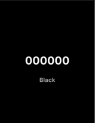
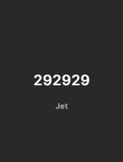
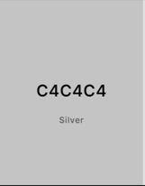
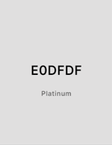
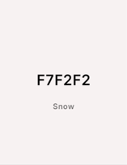

# RetroRides Rental Service Website

# Purpose
This Project is a static Vintage car rental website made for people who wish to relive the golden age of Automobiles. It is a rental service made for people who are planning a wedding, special event, or car enthusaist alike. Retro Rides gives a diverse fleet of vintage cars to choose from to suit your style.

The Core purposes of this website:
- Provide an easy to use website/app, for people who are interested in renting/driving rare vintage cars.
- Fulfill peoples dreams of being able to experience the golden age of automobiles.
- A place where people of different backgrounds can come together and share their common love of Vintage cars.
- To make it easy to find Rare vintage Vehicles.

This Website is to be passed as my first Milestone project for Code Institutes Fullstack development course.

[Click Here to see Live Website](https://jefferson-bantawig.github.io/RetroRides-Car-Rental/)

____

# UX Design

## User Stories
### As a first time user:
  - I want to have a visually pleasing experience.
  - I want to have an ituitive and easy to use website.
  - I want to immediately get an idea of the purpose of the website.
  - I want to easily navigate the site and access necessary content.
  - I want to find available selection of cars for rent.
  - I want to read about the services that the site has to offer as well as reviews of previous customers.
  - I want to get access necessary information with regards to any questions about the site through the contact us section.
  - I want to get in contact with a sales representative without any hassle.

### All users will also be able to access the website in smartphones and tablet screens.

# Structure

## Home Page
  - Uses bright colors to help engage users to the site.
  - Provides users the information they need right off the bat.
  - Feedback from previous customers gives new users a sense of trust to the website.
  ### User Goal:
   > - Understand what services website provides.
   > - View all pages and sections of the website.
   > - Navigate the website without any difficulties.
   > - Find all the selection of available cars.

  ### Website Goal:
   > - Grab users attention and engagement using bright colors and bold texts.
   > - Provides easy access of necessary information and car portfolio.
   > - Give insight on what the website can to offer.
   > - Links to social media are available to give users up to date information.

### Navigation bar
  - Positioned at the top of the page, contains the website logo on the left hand side, that directs the user to the home page when clicked.
  - On the right hand side are the the links to the other sections of the website such as "Services", "Help" and "Contact Us" sections.
  - The user will be able to see which page is currently active. The active page is highlighted in the nav bar with an orange background color and rounded padding.

     
  
  - When viewed on smaller screens, the menus texts changes to a clickable "burger" icon, in order to conserve space.
  - The logo and "burger" icon also swaps position to provide better access and functionality when using smaller screens.

### Landing Page
  - In smaller screens, the image of the car in the landing page will disappear in order to conserve space.
  - The bright background color and the color contrast of the text, helps to grab the attention of the user.
  - Users are given the option to download app in order to use the website more conveniently.

### Featured Cars
  - This section provides the user with 4 of the most popular cars rented by previous customers.
  - Hovering over the featured cars will reveal an overlay that pops up and gives a small feature of the car.
  - The overlay color contrast makes it easy to read the text written on it.
  - This is deactivated on tablets and phone screens as this is intented for use with a mouse cursor.

### Car Fill up box
  - The fill up box provides 3 inputs that the users are required to fill.
  - These inputs will prompt the user to fill out 3 boxes and provide details of what they are interested in.
  - Filling up the box will inform the website what the user is looking for and its availability.

### Cars section
  - This Section contains the all secection of cars for rent.
  - The boxes contains the exact images of the available cars, which gives the user an idea of what the car looks like.
  - Each car box contains the name of the Car in big letters, to make it easier to the user to find what they need.
  - Inside the car boxes, contains the mileage of the car, Fuel it needs, and its transmission. All indicated by their respective icons.
  - Below the icons, users will see the price for each car, as well as a bright orange "Enquire" button that captures the eyes of the user more easily.
  - These boxes are arranged in columns that changes in response to the width of the users screens. This helps to make it more pleasing to look at.

### Our Services Section
  - This section provides the user with information of the services that the website offers.
  - The section is design to be simple and informative, providing examples of the services in individual boxes to highlight what makes the website different from others.
  - The icons on the boxes help provide visual cues as to what the service is.
  - This design is also responsive and will change depending of the screen size.
  - The boxes follows the color scheme of the whole website.

### Review Section
  - This section provides feedback from previous satisfied customers, to give the website a sense of reliability in their quality of service.
  - The Review contains a picture of the reviewer, and a small paragraph of their story and how Retro Rides was satistfactory with their services.
  - The Images are designed with the intention of making it aesthetically pleasing to look at.
  - The names of the reviewers are highlighted in bright orange to follow the color scheme of the website and provide importance.

### About us Section
  - This section Provides a brief introduction to the website's goal and services, and showcases it's main purpose.
  - The styling and color scheme follow that of the whole website.
  - The words "Retro Rides" are highlighted and are in bigger font to add styling and focus on the website brand.
  - The image on this section are that of people smiling together. This is to provide as sense of unity with the community and the people behind Retro Rides.

### Footer Section
  - The footer section follows the same color scheme as the header section. This gives the website uniformity. 
  - Social media links can be found in this section, each with an icon of it's respective website. Using the logos of each social media website makes it look better compared to putting the website address.
  - The location of the garage is also found here just under the social media links.

     

  - The design on the footer section will change depending on the screen size.
  - In small screens, the footer layout is that of a single column. Starting from the website brand, social media links, garage address then to other navigation links.
  - In order to conserve space, the "Page" and "Support" section of the footer is nested inside a clickable dropdown list. 
  - A chevron icon is placed with the dropdown list to make it intuitive for the user, and provides visual cue for a dropdown button.
  - In bigger screens, the drop down button is disabled, chevron icon disappears and the whole content of the footer page is on display.

## Services Page
  - Provides boxes of information about the services Retro Rides has to offer.
  - Gives the types of packages Retro Rides caters, and highlights what separates it from other rental sites.
  - The "Our services" section which is also in the home page, can be seen here, as it falls under the "services" section of the website.
  ### User Goal:
   > - Get Information of the services the site provides.
   > - Find out what sets Retro Rides apart from others.
  ### Website Goal:
   > - To provide easy access to necessary information.
   > - Highlight the qualities that makes us different.
   > - Grab the users attention with pleasing style and design.
  
## Help Page
  - Gives the user a grid view of the help section columns. 
  - Shows the user a selection of the most common questions customers ask.
  - The help section boxes links to a different part of the website that contains the answers to it's respective questions.
  ### User Goal:
  > - Get the answers to any question the user may have.
  > - Get in touch with a representative.
  > - Learn how to pay and arrange booking of a car.
  ### Website Goal:
  > - Give users access to FAQ with ease.
  > - A simple click will link the user to the answers they are looking for.

## Contact Us Page
  - Allows users to fill up their contact information.
  - A text box allows the user to write down the car they want to book or any questions they want to ask.
  ### User Goal:
  > - Get in contact with a representative.
  > - Check availability of preferred car and reserve booking.
  ### Website Goal:
  > - Allows users to write their question in great detail using the text box.
  > - Aid users in checking availability and booking out their preferred cars.
  > - Collects user data to allow the representative to get in touch with the user.

  ___ 

## Design

Retro Rides is designed for car enthusiast and non-car enthusiast alike. Weather you want to experience the Golden days of automobiles or planning to have a memorable wedding, Retro Rides has got you covered. Having an extensive selection of Vintage cars, finding a rare vehicle has never been so easy. 

## Color Scheme

A bright and daring color palette helps that grabs the users attention. Matched with complementing accent colors, together the websites color scheme allows longer user engagement.

### ** Background Colors **
>  #ff5c35 (Main accent color of background, main heading colors, Background colors for boxes and buttons);
Represents enthusiasm energy and vibrance. The main color theme of the site, helps to grab users attention and maintain engagement.
>  #ffffff (Main Background color);
Helps to complement the main accent color and helps it pop more.
>  #000000 (Default Text color);
Makes text easily readable for the users.
>  #292929 (Header and footer Background color);
Gives a great accent color that separates the header and footer from the main section.
>  #c4c4c4 (Our Review and About us Background color and Featured car background color);
Gives a different background color to isolates the review and about us section.
>  #e0dfdf (Car booking box Background color);
Adds separation to Car booking box.
>  #f7f2f2 (Main heading Background color);
Adds importance and styling to the main headings of the page.

### Typography
[Roboto](https://fonts.google.com/?query=roboto) was chosen as the sole font style, as it is pleasing and easy to read. This also provides uniformity of the site.

### Images

The image for this project were taken from [Unsplash](https://unsplash.com/). Each Image were thoroughly reviewed and selected to match the websites theme and design.

### Visual Effects

### Shadows