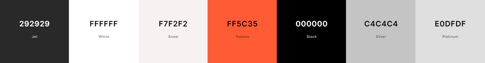

# RetroRides Rental Service Website

# Purpose
This Project is a static Vintage car rental website made for people who wish to relive the golden age of Automobiles. It is a rental service made for people who are planning a wedding, special event, or car enthusaist alike. Retro Rides gives a diverse fleet of vintage cars to choose from to suit your style.

The Core purposes of this website:
- Provide an easy to use website/app, for people who are interested in renting/driving rare vintage cars.
- Fulfill peoples dreams of being able to experience the golden age of automobiles.
- A place where people of different backgrounds can come together and share their common love of Vintage cars.
- To make it easy to find Rare vintage Vehicles.

This Website is to be passed as my first Milestone project for Code Institutes Fullstack development course.

[Click Here to see Live Website](https://jefferson-bantawig.github.io/RetroRides-Car-Rental/)

____

# UX Design

## User Stories
### As a first time user:
  - I want to have a visually pleasing experience.
  - I want to have an ituitive and easy to use website.
  - I want to immediately get an idea of the purpose of the website.
  - I want to easily navigate the site and access necessary content.
  - I want to find available selection of cars for rent.
  - I want to read about the services that the site has to offer as well as reviews of previous customers.
  - I want to get access necessary information with regards to any questions about the site through the contact us section.
  - I want to get in contact with a sales representative without any hassle.

### All users will also be able to access the website in smartphones and tablet screens.

# Structure

## Home Page
  - Uses bright colors to help engage users to the site.
  - Provides users the information they need right off the bat.
  - Feedback from previous customers gives new users a sense of trust to the website.
  ### User Goal:
   > - Understand what services website provides.
   > - View all pages and sections of the website.
   > - Navigate the website without any difficulties.
   > - Find all the selection of available cars.

  ### Website Goal:
   > - Grab users attention and engagement using bright colors and bold texts.
   > - Provides easy access of necessary information and car portfolio.
   > - Give insight on what the website can to offer.
   > - Links to social media are available to give users up to date information.

### Navigation bar
  - Positioned at the top of the page, contains the website logo on the left hand side, that directs the user to the home page when clicked.
  - On the right hand side are the the links to the other sections of the website such as "Services", "Help" and "Contact Us" sections.
  - The user will be able to see which page is currently active. The active page is highlighted in the nav bar with an orange background color and rounded padding.
  - When viewed on smaller screens, the menus texts changes to a clickable "burger" icon, in order to conserve space.
  - The logo and "burger" icon also swaps position to provide better access and functionality when using smaller screens.

### Landing Page
  - In smaller screens, the image of the car in the landing page will disappear in order to conserve space.
  - The bright background color and the color contrast of the text, helps to grab the attention of the user.
  - Users are given the option to download app in order to use the website more conveniently.

### Featured Cars
  - This section provides the user with 4 of the most popular cars rented by previous customers.
  - Hovering over the featured cars will reveal an overlay that pops up and gives a small feature of the car.
  - The overlay color contrast makes it easy to read the text written on it.
  - This is deactivated on tablets and phone screens as this is intented for use with a mouse cursor.

### Car Fill up box
  - The fill up box provides 3 inputs that the users are required to fill.
  - These inputs will prompt the user to fill out 3 boxes and provide details of what they are interested in.
  - Filling up the box will inform the website what the user is looking for and its availability.

### Cars section
  - This Section contains the all secection of cars for rent.
  - The boxes contains the exact images of the available cars, which gives the user an idea of what the car looks like.
  - Each car box contains the name of the Car in big letters, to make it easier to the user to find what they need.
  - Inside the car boxes, contains the mileage of the car, Fuel it needs, and its transmission. All indicated by their respective icons.
  - Below the icons, users will see the price for each car, as well as a bright orange "Enquire" button that captures the eyes of the user more easily.
  - These boxes are arranged in columns that changes in response to the width of the users screens. This helps to make it more pleasing to look at.

### Our Services Section
  - This section provides the user with information of the services that the website offers.
  - The section is design to be simple and informative, providing examples of the services in individual boxes to highlight what makes the website different from others.
  - The icons on the boxes help provide visual cues as to what the service is.
  - This design is also responsive and will change depending of the screen size.
  - The boxes follows the color scheme of the whole website.

### Review Section
  - This section provides feedback from previous satisfied customers, to give the website a sense of reliability in their quality of service.
  - The Review contains a picture of the reviewer, and a small paragraph of their story and how Retro Rides was satistfactory with their services.
  - The Images are designed with the intention of making it aesthetically pleasing to look at.
  - The names of the reviewers are highlighted in bright orange to follow the color scheme of the website and provide importance.

### About us Section
  - This section Provides a brief introduction to the website's goal and services, and showcases it's main purpose.
  - The styling and color scheme follow that of the whole website.
  - The words "Retro Rides" are highlighted and are in bigger font to add styling and focus on the website brand.
  - The image on this section are that of people smiling together. This is to provide as sense of unity with the community and the people behind Retro Rides.

### Footer Section
  - The footer section follows the same color scheme as the header section. This gives the website uniformity. 
  - Social media links can be found in this section, each with an icon of it's respective website. Using the logos of each social media website makes it look better compared to putting the website address.
  - The location of the garage is also found here just under the social media links.

     

  - The design on the footer section will change depending on the screen size.
  - In small screens, the footer layout is that of a single column. Starting from the website brand, social media links, garage address then to other navigation links.
  - In order to conserve space, the "Page" and "Support" section of the footer is nested inside a clickable dropdown list. 
  - A chevron icon is placed with the dropdown list to make it intuitive for the user, and provides visual cue for a dropdown button.
  - In bigger screens, the drop down button is disabled, chevron icon disappears and the whole content of the footer page is on display.

## Services Page
  - Provides boxes of information about the services Retro Rides has to offer.
  - Gives the types of packages Retro Rides caters, and highlights what separates it from other rental sites.
  - The "Our services" section which is also in the home page, can be seen here, as it falls under the "services" section of the website.
  ### User Goal:
   > - Get Information of the services the site provides.
   > - Find out what sets Retro Rides apart from others.
  ### Website Goal:
   > - To provide easy access to necessary information.
   > - Highlight the qualities that makes us different.
   > - Grab the users attention with pleasing style and design.
  
## Help Page
  - Gives the user a grid view of the help section columns. 
  - Shows the user a selection of the most common questions customers ask.
  - The help section boxes links to a different part of the website that contains the answers to it's respective questions.
  ### User Goal:
  > - Get the answers to any question the user may have.
  > - Get in touch with a representative.
  > - Learn how to pay and arrange booking of a car.
  ### Website Goal:
  > - Give users access to FAQ with ease.
  > - A simple click will link the user to the answers they are looking for.

## Contact Us Page
  - Allows users to fill up their contact information.
  - A text box allows the user to write down the car they want to book or any questions they want to ask.
  ### User Goal:
  > - Get in contact with a representative.
  > - Check availability of preferred car and reserve booking.
  ### Website Goal:
  > - Allows users to write their question in great detail using the text box.
  > - Aid users in checking availability and booking out their preferred cars.
  > - Collects user data to allow the representative to get in touch with the user.

  ___ 
## Wireframe
 

___

## Design

Retro Rides is designed for car enthusiast and non-car enthusiast alike. Weather you want to experience the Golden days of automobiles or planning to have a memorable wedding, Retro Rides has got you covered. Having an extensive selection of Vintage cars, finding a rare vehicle has never been so easy. 

## Color Scheme

A bright and daring color palette helps that grabs the users attention. Matched with complementing accent colors, together the websites color scheme allows longer user engagement.

### ** Background Colors **
>    **#ff5c35** (Main accent color of background, main heading colors, Background colors for boxes and buttons);
Represents enthusiasm energy and vibrance. The main color theme of the site, helps to grab users attention and maintain engagement.
>    **#ffffff** (Main Background color);
Helps to complement the main accent color and helps it pop more.
>    **#000000** (Default Text color);
Makes text easily readable for the users.
>    **#292929** (Header and footer Background color);
Gives a great accent color that separates the header and footer from the main section.
>    **#c4c4c4** (Our Review and About us Background color and Featured car background color);
Gives a different background color to isolates the review and about us section.
>    **#e0dfdf** (Car booking box Background color);
Adds separation to Car booking box.
>    **#f7f2f2** (Main heading Background color);
Adds importance and styling to the main headings of the page.

### Typography
[Roboto](https://fonts.google.com/?query=roboto) was chosen as the sole font style, as it is pleasing and easy to read. This also provides uniformity of the site.

### Images

The image for this project were taken from [Unsplash](https://unsplash.com/). Each Image were thoroughly reviewed and selected to match the websites theme and design.

### Visual Effects

### Shadows
The main section of the website is contained inside boxes, In order to make this more profound and noticeable, shadows have been added to these boxes to make them stand out and draw the eyes of the user.

### Overlay
The Featured car section highlights the most popular cars in the portfolio. To give this a bit of emphasis, an overlay has been added to each of the car sections. As the user hovers on the car, an overlay containing the name of the car and a small paragraph about its features will show up in a smooth transition. This feature makes it more interactive and engaging. As this feature is designed to use with a mouse, it is disabled for tablets and mobile devices.

### Links
The website is packed of information. It is important that the users can navigate through the site without any struggle, thus steps were taken to make sure all the links in the website work properly. Clicking on the links and buttons will open a new tab directing it to the appropriate page, this is done so the user does not lose the page they were in before.

### Nav Bar Effects
The nav bar contains a logo, clicking this will redirect the user to the home page. To make the nav bar more interactive, a hover effect has been added. Hovering on the headings on the nav bar will trigger it's background color to change. The background color of the current page will remain highlighted on the nav bar. This gives a sense of direction informing the user what section of the website they are currently on.

____

# Features
 ## Navigation Bar 
       

The nav bar contains a logo on the left hand side, and webpage sections Home, Services, Help, and Contact Us on the right hand side. On smaller screens the sections is contained inside a hamburger menu. The location of the logo will transfer to the right side with the hamburger menu no being on the left side. This makes the design more ergonomic for phone users. The nav bar will stick to the top of the users screen at all times in all of the pages.

 ## Hero Section 

The Hero section gives eye catching design with the bright orange color to draw the users eyes, paired with a high quality image of a vintage car. This gives an impactful first impression to the user. The brand of the site "Retro Rides" is styled with a big and colorful font to give it importance. A small paragraph of introduction is given under the main heading to give the user an idea of the service it is offering. At the very bottom of the hero section are 3 clickable links which directs the user to the app store, google store and Services page.

## Featured Cars

The featured cars section gives the user and idea of the most common cars rented. It highlights 4 of the most popular cars users go for. Whenever a car is hovered, an overlay pops up smoothly revealing a small paragraph that gives an inroduction of the car. This overlay design makes for an interactive experience.

 ## Car Fill-up Box
 

The Fill up box allows users to select the make and specific model of the car they are interested in. The users can use the fill up box to provide information such as the preferred car make, why they are interested in the car, and when they want to use the car.

## Cars Section

 

 The cars section shows the user the entire portfolio of cars available. A grid of columns allows the users to see the image of the actual car they can rent. Under the images contains the year and name of the car. Icons are used intuitively to display the mileage, type of fuel and Transmission of the car. The Enquire button is styled to follow the color scheme of the website, hovering on the button changes its opacity to make it interactive, clicking on the button will direct the user to the contact us page.

 ## Our Services 
 
 
 Our services section is designed to capture the attention of users. The bright colored box highlights the qualities that separates Retro Rides from other rental websites. The responsive design keeps its pleasing to look at in whatever screen used.

## Our Reviews

 

 The review section shares the stories of previous satisfied customers, this shows the users that Retro Rides gives reliable and satifactory services to its users. The section shows a smiling image of the reviewer and is styled to aesthetically please the eyes.

## About Us

The About us section introduces the users to Retro Rides and their passion for vintage cars. It shows the enthusiasm and love for cars and their service to their customers.

## Footer

The Footer section is found at the very bottom part of all the pages. It follows the color scheme of the header and contains all the necessary links to the most common sections of the website, from social media links, address, Page column where the most common sections of the page is linked to, and the Support column where users can find links to all resources to help them with any queries.

## Services Page

      

The Services section provides the user with the list of services offered, from standard rentals to weddings and photoshoots. The color scheme and design of the boxes is similar to the design of the website. 

A circular image of 2 employees gives a nice aesthetic design to the page.

The our services section can also be found in this page. This is to contain all services related sections into one page.

## Help Page

This help pages contains a grid of clickable icons for the user to use. The boxes presents the most common questions the user can have. Each boxes links to another page that opens in a new tab to make it easier for the user.

## Contact Us Page

The contact us page provides an aesthetically looking page with a beautiful black and white background image that complements the colors of the form column. 

In this page, the user can fill in their details and book their car or ask any questions they may have.
The data given here will be sent to a form dump. In future with the use of Javascript or Python, the data can be stored and utilized to give a better user experience.

## Responsive Design

The webpage is designed to be responsive. Using flexbox and grid, the layout changes when viewed in different screen sizes. The design of the site was first initiated on a 280x653 resolution which is one of the more common resolutions for smartphones. The most clearly noticeable difference between small and large screens is the hero image on the landing screen. It was decided to not add the large hero image on smaller screen for real estate purposes. The responsive design was also tested in other common screen resolutions such as 320px for mobile, 375px, 425px, 768px, 1024px and 1440px. Each is resolution designed to look balanced and aesthetically pleasing to all devices. Another noticeable difference is the overlay feature, which is only active for laptop screens and above, as this feature needs a mouse cursor to activate.

## Feature Considerations
The Fill up form in the Home page, and the contact us form in the Contact us page, is sent to a form dump. The data in this filled in these will not be stored or utilized without the use of JavaScript or python. In the future, this can be an added feature to improve the user experience.

# Technologies 
 - HTML for the structure of the website.
 - CSS to add design and styling to the website.
 - Google lighthouse to test for acessibility and loading of the webpage.
 - Chatgpt for formulating text content used for the site.
 - [Gitpod](https://gitpod.io/) IDE for developing website.
 - [Github](https://GitHub.com/) to host the source code and deploy and host live site and for version control.
 - [FontAwesome](https://fontawesome.com/) Icons.
 - [Google Fonts](https://fonts.google.com/) For Typography.
 - [Chrome Developer Tool](https://developers.google.com/web/tools/chrome-devtools) For debugging and testing layouts.
 - [Convertio](https://convertio.co/jpg-webp/) To convert jpeg files to webp for better web optimization.
 - [Icons8](https://icons8.com/) For making the website favicon.
 - [Coolors](https://coolors.co/) For choosing website color palette.
 - [Balsamiq](https://balsamiq.com/) For Wireframe design.
 - [W3C HTML Markup Validator](https://validator.w3.org/) to validate HTML code.
 - [W3C Jigsaw CSS Validator](https://jigsaw.w3.org/css-validator/) to validate CSS code.

___

# Testing and Validation

The website was tested using the Chrome Developer tool and through manual testing. Links and buttons were individually checked multiple times.

| Test               | Desired Outcome                                             | Result |
|--------------------|-------------------------------------------------------------|--------|
| Car Logo           | Redirects page to Home                                      | Pass   |
| Navigation bar     | Redirects to different pages of the website                 | Pass   |
| Navigation Hover   | Background color and padding appears when hovering          | Pass   |
| Overlay            | Overlay appears when hovering on Featured car               | Pass   |
| Fill Up Form       | Stores Information into Form Dump                           | Pass   |
| Enquire Button     | Opens new tab to Contact us section                         | Pass   |
| Social Media Icons | Links to social media site                                  | Pass   |
| Footer Links       | Opens new tab to respective links                           | Pass   |
| Explore Help Page  | Hovering changes opacity, and Correct links open in new tab | Pass   |
| Contact Us Button  | Sends the data entered to Form dump                         | Pass   |

# Problems & Bugs Encoutered

 - There were a few bugs and problems that came up in the making of this code. One of the main ones was the IDE codeanywhere not working a lot of the times, in order to keep my project within the deadline, I resulted to using Vscode in order to store my code. I continued working on my project in vscode whenever Codeanywhere was down, and then pasted my code into Codeanywhere whevener it was back up and running. This is the main reason why my commits in github are so few.

 - There was a bug encountered when validating application and enquire buttons on the landing page. The validator failed because my anchor element nested a button element. The remedy used for this was to get rid of the button element and style the anchor element to look like a button, which in the end passed the validator.

 ___

 # Deployment 

 This project was deployed using GitHub, The steps I made were as follows:
1. Logged in to GitHub.com.
2. Selected Retrorides-Car-Rental from the repositories.
3. Clicked settings from the subheadings in the repository. 
4. Clicked the pages menu under the Code and automations section located on the left side of the screen.
5. Selected "main" in the dropdown menu under the source heading.
6. Selected "root" on the next dropdown menu.
7. Clicked save.
8. Waited for a few minutes and refreshed the page.
9. Went back to my Retrorides-Car-Rental repository.
10. Clicked Deployment tab in the right side of the page.
11. Clicked the link under GitHub pages.

# How to Clone the repository

1. Go to the GitHub repository Jefferson-Bantawig/RetroRides-Car-Rental.
2. Click the code dropdown menu highlighted in green.
3. Copy the link under the HTTPS heading.
4. Open IDE of your choice and open the terminal.
5. Type in "git clone" and paste the copied link.
6. You will now have a clone of this repository.

# Acknowledgements

- I would like to thank my Mentor Ronan McClelland for his guidance on making my first project, he was kind enough to squeeze our meetings into his busy schedule. 

- I would like to thank the slack community in helping me with any questions that I had.

- I would like to say thank you to the tutors at codeinstitute for their patience and guidance whenever i had trouble understanding something.

- I would like to credit the peer-code-review channel in code institute, which helped me get an idea on how to structure my readme file.
# Credits

- I would like to credit unsplash.com for the high quality images used in this project.
- I would like to credit wall.alphacoders.com for the high quality car images for this project.
- I would like to credit help.vipcars.com for the inspiration for a grid layout on the help page.
- I would like to credit Fahker Uddin from dribbble.com for the inspiration of making a car rental website.

 