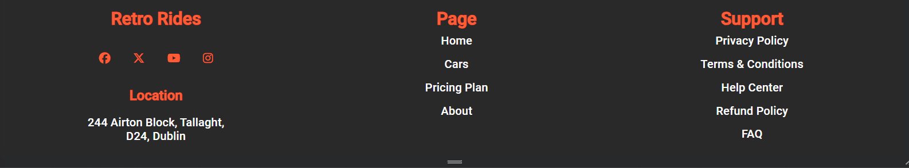

# RetroRides Rental Service Website

# Purpose
This Project is a static Vintage car rental website made for people who wish to relive the golden age of Automobiles. It is a rental service made for people who are planning a wedding, special event, or car enthusaist alike. Retro Rides gives a diverse fleet of vintage cars to choose from to suit your style.

The Core purposes of this website:
- Provide an easy to use website/app, for people who are interested in renting/driving rare vintage cars.
- Fulfill peoples dreams of being able to experience the golden age of automobiles.
- A place where people of different backgrounds can come together and share their common love of Vintage cars.
- To make it easy to find Rare vintage Vehicles.

This Website is to be passed as my first Milestone project for Code Institutes Fullstack development course.

[Click Here to see Live Website](https://jefferson-bantawig.github.io/RetroRides-Car-Rental/)

____

# UX Design

## User Experience
### First time users will be able to:
    - See at first glance what the main purpose of the site.
    - Appreciate the eye-catching design of the website's landing page.
    - Get a small introduction to the site through the landing page.
    - Easily navigate the site and access necessary content.
    - Find available selection of cars for rent.
    - Use the search bar to find the ideal model available.
    - Read about the services that the site has to offer as well as reviews of previous customers.
    - Access necessary information with regards to any questions about the site through the contact us section.
    - Find the address and social media links of the site from the footer section.
    - Join a community of people that have the same interest by Registering and logging in to the website.

    ### All users will also be able to access the website in smartphones and tablet screens.

## Structure

### Navigation bar

    - Positioned at the top of the page, contains the website logo on the left hand side, that directs the user to the home page when clicked.
    - On the right hand side are the the links to the other sections of the website such as "Services", "Contact us" and "Log in" sections.
    - The log in link, contains a user icon to indicated to the user that this section is where they can register and log in. 
  
     ---> 
    
    - When viewed on smaller screens, the menus texts changes to a clickable "burger" icon, in order to conserve space.
    - The logo and "burger" icon also swaps position to provide better access and functionality when using smaller screens.

### Landing Page

    - In smaller screens, the image of the car in the landing page will disappear in order to conserve space.
    - The bright background color and the color contrast of the text, helps to grab the attention of the user.
    - Users are given the option to download app in order to use the website more conveniently.

### Featured Cars

    - This section provides the user with 4 of the most popular cars rented by customers.
    - Hovering over the featured cars will reveal an overlay that pops up and gives a small feature of the car.
    - The overlay color contrast makes it easy to read the text written on it.
  
### Search Bar

    - The search bar provides 3 inputs that the users are required to fill.
    - These inputs will aid the users to quickly find the car that they have in mind, if it is available.
    - This will help users to manage booking as they can provide information on when to pick up and return the car of their choice.

### Cars section

    - This Section contains the all available cars for rent.
    - The boxes contains the exact images of the available cars, which gives the user an idea of what the car looks like.
    - Each car box contains the name of the Car in big letters, to make it easier to the user to find what they need.
    - Inside the car boxes, contains the mileage of the car, Fuel it needs, and its transmission. All indicated by their respective icons.
    - Below the icons, users will see the price for each car, as well as a bright orange "rent" button that captures the eyes of the user more easily.
    - These boxes are arranged in columns that changes in response to the width of the users screens. This helps to make it more pleasing to look at.

### Services Section

    - This section provides the user with information of the services that the website offers.
    - The section is design to be simple and informative, providing examples of the services in individual boxes to highlight what makes the website different from others.
    - The icons on the boxes help provide visual cues as to what the service is.
    - This design is also responsive and will change depending of the screen size.
    - The boxes follows the color scheme of the whole website.

### Review Section

    - This section provides feedback from previous satisfied customers, to give the website a sense of reliability in their quality of service.
    - The Review contains a picture of the reviewer, and a small paragraph of their story and how Retro Rides was satistfactory with their services.
    - The Images are designed with the intention of making it aesthetically pleasing to look at.
    - The names of the reviewers are highlighted in bright orange to follow the color scheme of the website and provide importance.

### About us Section

    - This section Provides a brief introduction to the website's goal and services, and showcases it's main purpose.
    - The styling and color scheme follow that of the whole website.
    - The words "Retro Rides" are highlighted and are in bigger font to add styling and focus on the website brand.
    - The image on this section are that of people smiling together. This is to provide as sense of unity with the community and the people behind Retro Rides.

### Footer Section

    - The footer section follows the same color scheme as the header section. This gives the website uniformity. 
    - Social media links can be found in this section, each with an icon of it's respective website. Using the logos of each social media website makes it look better compared to putting the website address.
    - The location of the garage is also found here just under the social media links.

     --> 

    - The design on the footer section will change depending on the screen size.
    - In small screens, the footer layout is that of a single column. Starting from the website brand, social media links, garage address then to other navigation links.
    - In order to conserve space, the "Page" and "Support" section of the footer is nested inside a clickable dropdown list. 
    - A chevron icon is placed with the dropdown list to make it intuitive for the user, and provides visual cue for a dropdown button.
    - In bigger screens, the drop down button is disabled, chevron icon disappears and the whole content of the footer page is on display.
